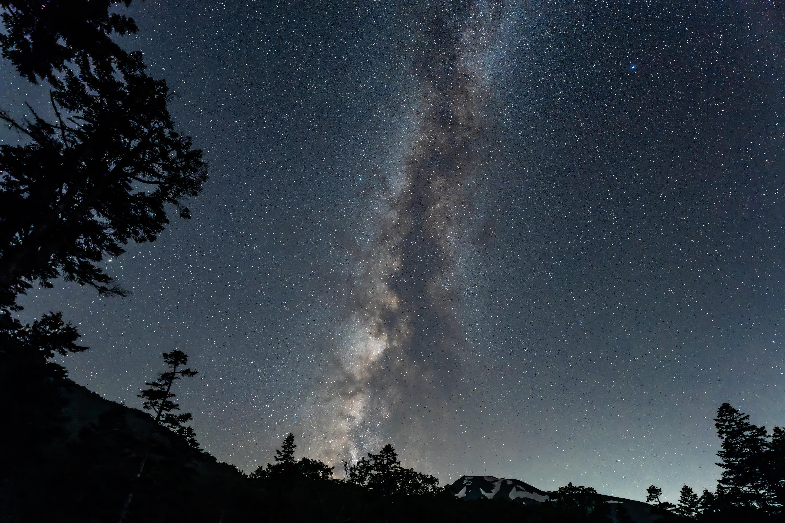

# 🔭 OpenStellar

**OpenStellar** is an **interactive 3D galaxy visualization** that maps the GitHub artificial intelligence ecosystem. Discover the vast landscape of AI development, from large language models to deep learning frameworks, all rendered in a stunning cosmic display! 🛸

<div align="center">
  
</div>

# ✨ Main Features

- **3D Galaxy Rendering:** 🌌 WebGL-powered visualization handling 8,000+ open-source repositories.
- **AI-Focused Mapping:** 🤖 Exclusively tracks LLMs, deep learning frameworks, and AI repositories.
- **Interactive Exploration:** 🔍 Search repositories, filter by language, and navigate the AI constellation.

# ✅ Prerequisites

- **Python 3.12+**, available through the [**official website**](https://www.python.org/downloads/).
- **Node.js 20+**, available through the [**official website**](https://nodejs.org/).
- **GitHub Token (PAT)** with read permissions for public repos.

# 🛠️ Local Installation

```bash
# Clone the repository
git clone https://github.com/germanocastanho/openstellar.git

# Navigate to the directory
cd openstellar

# Set up the Python environment
uv venv .venv
source .venv/bin/activate
uv pip install -r requirements.txt

# Install frontend dependencies
npm install

# Configure your GitHub token
echo "GH_TOKEN=YOUR_GITHUB_TOKEN" > .env
```

# 🚀 Getting Started

```bash
# Run the complete pipeline
uv run python -m indexer.main && node pipeline/layout.js && npm run build

# Or start the development server
npm run dev
```

# 📜 Free Software

Distributed under the [**GNU GPL v3**](LICENSE), ensuring freedom to use, modify, and redistribute the software while preserving these rights in derivative works. Join a thriving community of developers building an open, collaborative technological future through **free software**! ✊
